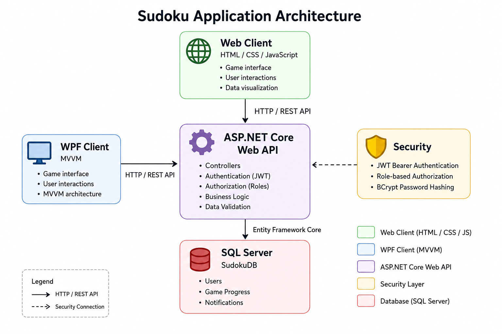

Sudoku

A full-stack Sudoku application built with C# and .NET. The project combines an ASP.NET Core Web API, SQL Server database, WPF desktop client and web client.

Features:
- Sudoku game with multiple difficulty levels
- User registration and authentication
- JWT-based authentication and authorization
- BCrypt password hashing
- Game progress tracking
- Lives and scoring system
- Leaderboard
- Personal statistics
- Notifications
- Admin panel
- Role-based authorization
- REST API
- Swagger / OpenAPI documentation

Technologies:

Backend
- C#
- ASP.NET Core Web API
- Entity Framework Core
- SQL Server
- JWT Bearer Authentication
- BCrypt
- Swagger / OpenAPI

Desktop Client
- C#
- WPF
- XAML
- MVVM

Web Client
- HTML
- CSS
- JavaScript

Architecture

Authentication and Security

The application uses JWT Bearer Authentication for user authorization. Passwords are stored using BCrypt hashing rather than plain text. Role-based authorization is used to protect administrator functionality. JWT and administrator credentials are stored using ASP.NET Core User Secrets during local development. Sensitive credentials are not stored in the repository.

Database

The application uses SQL Server with Entity Framework Core. The project includes Entity Framework Core migrations for database creation and updates.
Main entities include:
- Users
- Game progress
- Notifications

User Secrets

Configure the following secrets for local development:

Jwt:Secret  
Admin:Login  
Admin:Password

Do not commit real secrets to the repository.

Project Structure

MyProgramSudoku/
│
├── SudokuAPI/
│   ├── Controllers/
│   ├── Data/
│   │   ├── AppDbContext.cs
│   │   └── DbSeeder.cs
│   ├── Models/
│   ├── Migrations/
│   ├── Program.cs
│   └── appsettings.json
│
├── SudokuEcosystem/
│   ├── Models/
│   ├── Services/
│   ├── ViewModels/
│   └── Views/
│
├── index.html
├── .gitignore
└── SudokuAPI.slnx

Future Improvements
-Improved error handling
-Improved Sudoku generation and validation
-UI improvements

Project Status

This project was created as a learning and portfolio project and is still open to further improvements.
